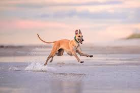
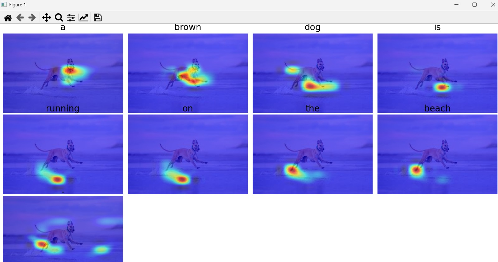

# 👁️🗣️ Show, Attend, and Tell: Image Captioning with Visual Attention


## 📌 Project Overview
This project implements the famous **"Show, Attend and Tell"** neural network architecture to automatically generate descriptive captions for images. 

Unlike standard image captioning models that simply guess the next word, this model uses an **Attention Mechanism**. As it generates each word of the caption, it calculates mathematical weights to determine exactly which pixels of the image it needs to "look at."

## 💻 Tech Stack
* **Language:** Python 3.x
* **Deep Learning Framework:** PyTorch, Torchvision
* **Data Processing & Math:** NumPy, Pillow (PIL)
* **Visualization:** Matplotlib (for plotting attention heatmaps)

---

## 🌟 Example Output & Attention Heatmap

**1. Input Image:** 



**2. Generated Caption:** > *"a brown dog is running on the beach ."*

**3. Attention Heatmap:** *(Notice how the AI focuses on the dog when saying "dog", and the sand when saying "beach")*


---

## 🧠 Architecture


The model is split into two main components:
1. **The Encoder ("Show"):** A Convolutional Neural Network (CNN) that processes the input image and extracts a rich set of visual features.
2. **The Decoder ("Attend and Tell"):** A Long Short-Term Memory (LSTM) network equipped with an Attention Mechanism. It generates the sentence word-by-word while visually focusing on different parts of the image feature map.

## 🗄️ Dataset
This model was trained from scratch using the **Flickr8k Dataset**, which contains 8,000 images, each paired with 5 different descriptive captions.

---

## 🚀 Implementation Steps & How to Run

### Step 1: Clone the Repository
```bash
git clone https://github.com/Samriddhi-2005/Image-Captioning-Show-Attend-Tell.git
cd Image-Captioning-Show-Attend-Tell
```

### Step 2: Install Dependencies
Ensure you have Python installed, then install the required libraries:

```bash
pip install torch torchvision matplotlib numpy pillow
```

### Step 3: Setup Pre-trained Weights
Since the model weights are too large for GitHub, you need to download them locally:

Download the pre-trained .pth files from here: [https://drive.google.com/file/d/1Jky-2zQI8T0Uw_NkbKyq30_kh0dtEczv/view?usp=sharing] [https://drive.google.com/file/d/13Zt_1DyjG4UTt7rCa96AVpkkw3zzoYBS/view?usp=sharing]

Place these files directly into your project's main directory.

### Step 4: Run Inference (Generate a Caption)
To test the model on a new image:
1. Place your target image in the project folder.
2. Open predict.py and update the test_image_path variable to match your image's file name.
3. Run the script:

```bash
python predict.py
```
This will print the generated caption to the terminal and open a visual grid of the attention heatmaps!

---

## 📚 References
Original Paper: Xu, K., Ba, J., Kiros, R., Cho, K., Courville, A., Salakhudinov, R., Zemel, R., & Bengio, Y. (2015). "Show, Attend and Tell: Neural Image Caption Generation with Visual Attention." Proceedings of the 32nd International Conference on Machine Learning (ICML).

Dataset: Hodosh, M., Young, P., & Hockenmaier, J. (2013). "Framing Image Description as a Ranking Task: Data, Models and Evaluation Metrics." Journal of Artificial Intelligence Research.

(https://arxiv.org/abs/1502.03044)
(https://github.com/kelvinxu/arctic-captions?tab=readme-ov-file)
